# netlify-functions-landingpage
A serverless-less landing page project on Netlify, including a Mailchimp mailing list signup via functions.

## Background
I read the interesting article on the [Serverless blog](https://serverless.com/blog/how-to-create-landing-page-with-serverless-components/) about how to create a landing page with Serverless Components, Netlify, AWS and Mailchimp. 

I wanted to test Netlify for a while now, but thought that the above example could still be stripped-down to a Netlify-only deployment. The Mailchimp API is still triggered via the included Lambda function for the signup.

## Setup

1. Fork the [project](https://github.com/tobilg/netlify-functions-landingpage) to your GitHub, GitLab or Bitbucket account
2. Sign up for Mailchimp (free account), for being able to create the mailing list funtionality
3. Sign up for Netlify (free account), using the OAuth integration to the repo provider you forked the project to.

### Mailchimp setup

#### Signup

Go to the [signup page](https://login.mailchimp.com/signup/) and fill in your info.

#### List creation

Go to Lists -> Create list and fill in your details:

**Step 1:**

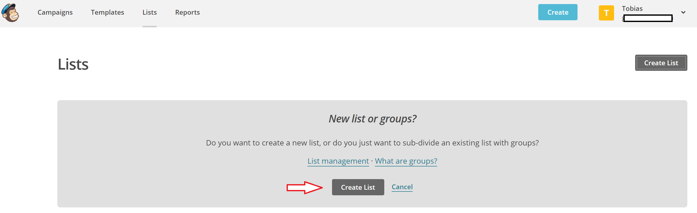

**Step 2:**

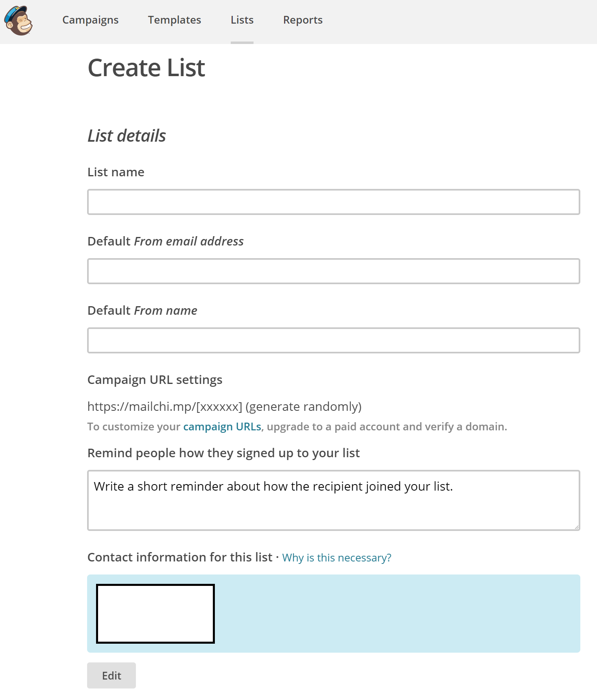

**Step 3:**

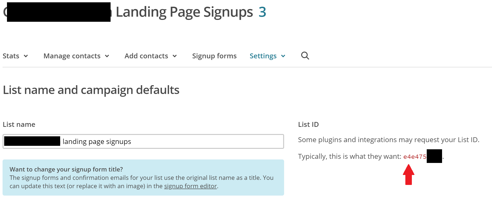

Please note the `List ID`, because this is later needed as an environment variable for the Netlify builds as `MAILCHIMP_LIST_ID`.

#### API key creation

Go to Account (upper right dropdown) -> Extras -> API keys and create an API key as follows: 

**Step 1:**

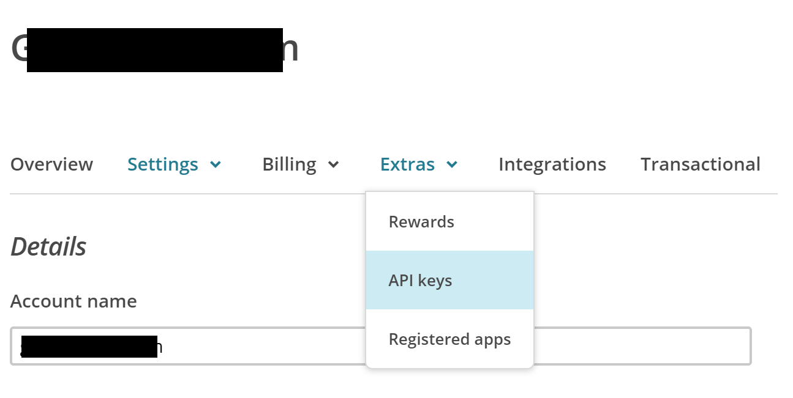

**Step 2:**

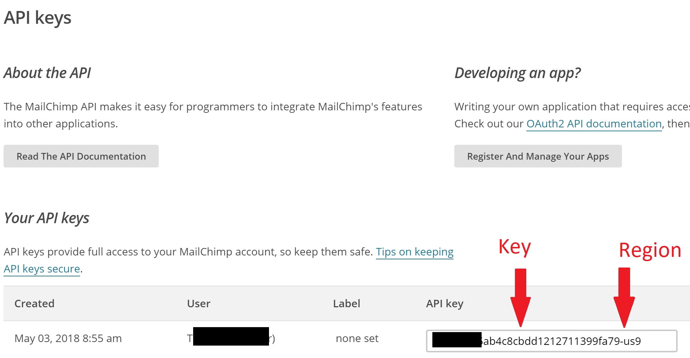

Please note the (full) `API key`, because this is later needed as an environment variable for the Netlify builds as `MAILCHIMP_API_KEY`, as well as the region (after the dash), because this will be set as `MAILCHIMP_REGION`.

### Netlify setup

#### Signup

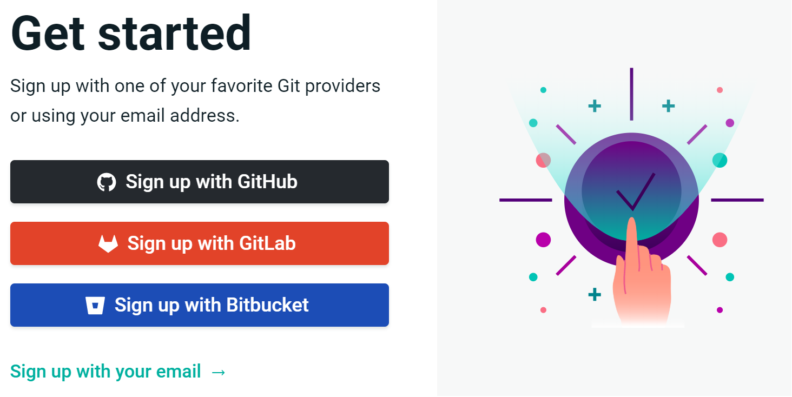

#### Create new site

**Step 1:**

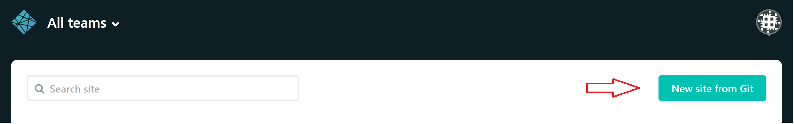

**Step 2:**

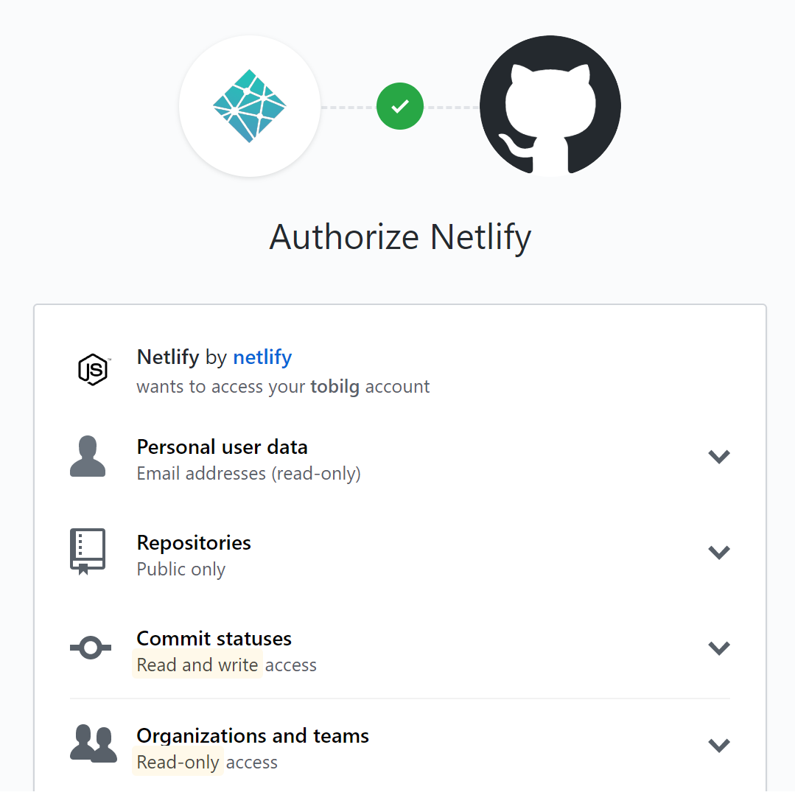

**Step 3:**

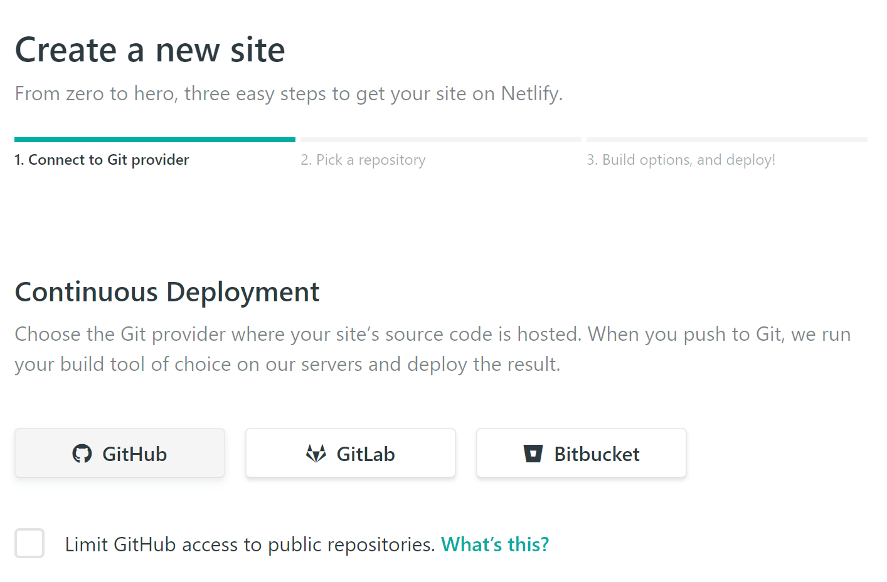

**Step 4:**

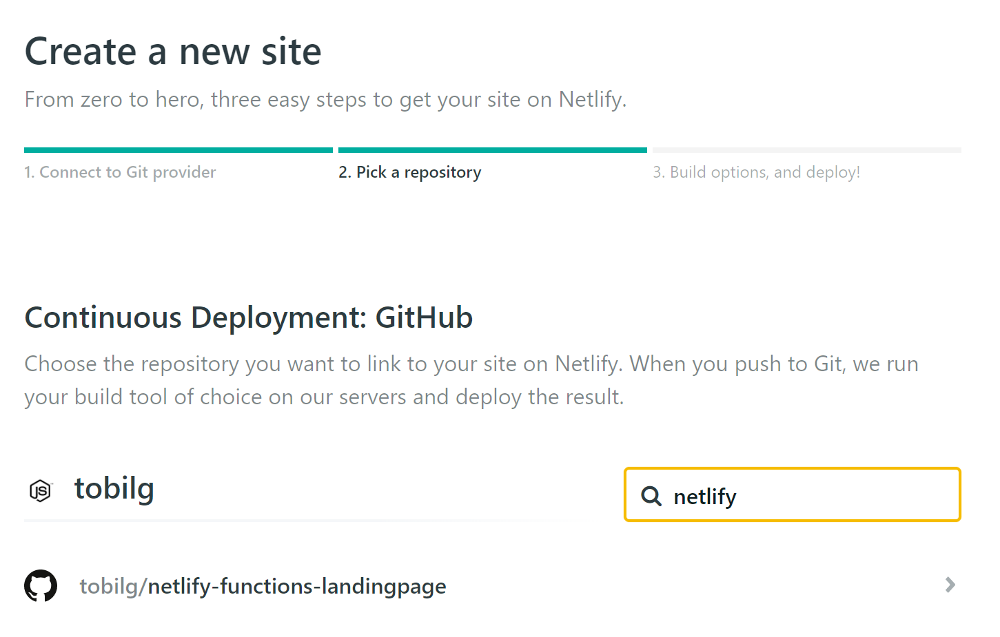

**Step 5:**

After that, the site should trigger its first deployment automatically.

#### Set environment variables

**Step 1:**

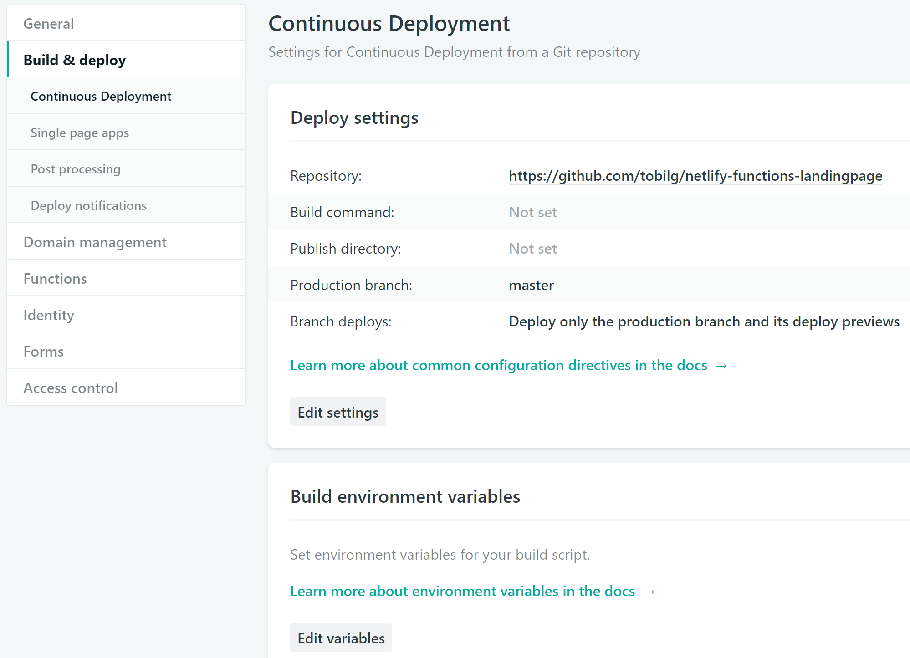

**Step 2:**

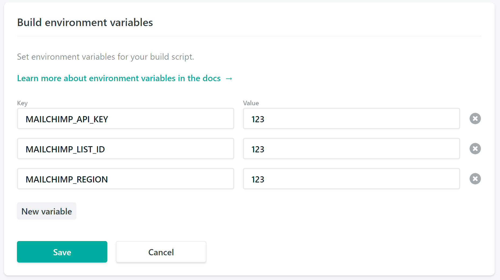

#### Trigger deployment

After triggering a redeployment via

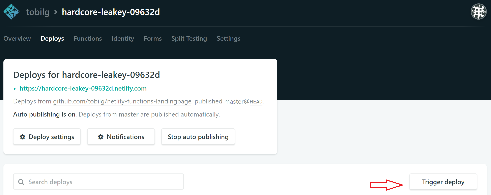

the site should be redeployed, and be using the provided environment variables for the Mailchimp integration.

#### Check function logs

You should then be able to check the function logs

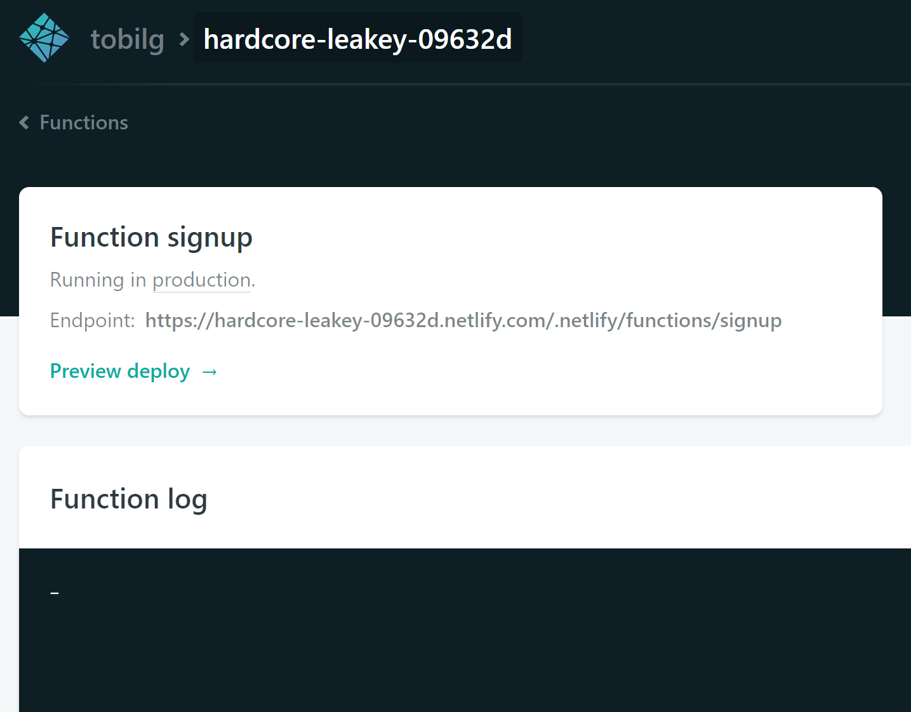

